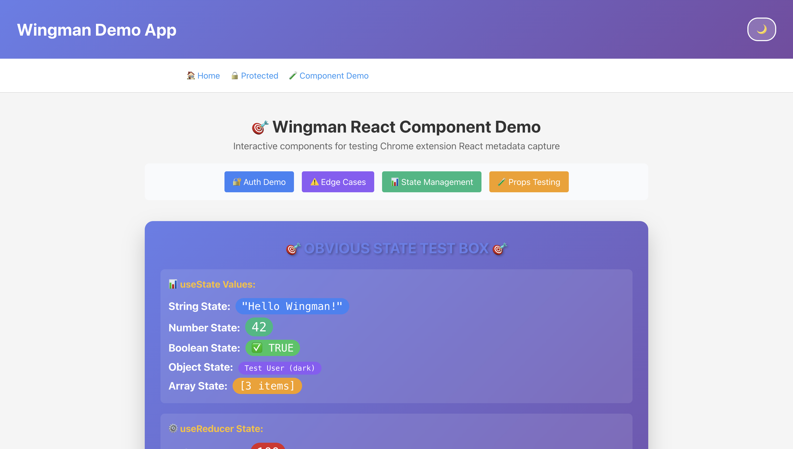

# 🎯 UI Feedback Request

## 📝 User Feedback

> **Button should be info color**

---

## 🖼️ Screenshot Analysis Required

**IMPORTANT**: Please carefully examine the screenshot below to understand the visual context of the UI issue.



_The screenshot above shows the exact area where the user is reporting an issue._

---

## 🎨 Visual Context

- **Selected Area:** 132.96875×40 pixels at position (427.75, 327)

- **Selection Mode:** Specific Element

- **CSS Selector:** `#root > div.app.light > div:nth-child(3) > header:nth-child(1) > nav:nth-child(3) > a:nth-child(1)`

---

## 📍 Page Information

- **URL:** http://localhost:5173/
- **Title:** Vite + React
- **Viewport:** 1512×857 (DPR: 2)
- **Captured:** 9/26/2025, 10:17:29 AM

## 🔧 Technical Details

### React Component Info

- **Component:** LinkWithRef
- **Data Source:** sdk

**Props:**

```json
{
  "to": "/auth-demo",
  "style": {
    "padding": "8px 16px",
    "background": "#3b82f6",
    "color": "white",
    "textDecoration": "none",
    "borderRadius": "4px"
  },
  "children": "🔐 Auth Demo"
}
```

**State:**

```json
{
  "useState0": [
    {
      "pathname": "/auth-demo",
      "search": "",
      "hash": ""
    },
    ["/auth-demo", "[\"/\"]", "/", null]
  ],
  "useState1": {
    "current": true
  },
  "useState2": {
    "tag": 5,
    "create": "[Function]",
    "deps": null,
    "next": "[Circular]"
  },
  "useState3": [
    "[Function]",
    [
      "/",
      {
        "action": "POP",
        "location": {
          "pathname": "/",
          "search": "",
          "hash": "",
          "state": null,
          "key": "[Redacted]"
        },
        "listen": "[Function]",
        "createHref": "[Function]",
        "createURL": "[Function]",
        "encodeLocation": "[Function]",
        "push": "[Function]",
        "replace": "[Function]",
        "go": "[Function]"
      },
      "[\"/\"]",
      "/",
      null
    ]
  ],
  "useState4": [
    {
      "pathname": "/auth-demo",
      "search": "",
      "hash": ""
    },
    ["/auth-demo", "[\"/\"]", "/", null]
  ],
  "useState5": [
    "[Function]",
    [
      {
        "pathname": "/",
        "search": "",
        "hash": "",
        "state": null,
        "key": "[Redacted]"
      },
      "[Function]",
      {
        "pathname": "/auth-demo",
        "search": "",
        "hash": ""
      },
      null,
      null,
      null,
      "/auth-demo",
      null,
      null,
      null
    ]
  ]
}
```

### ⚠️ JavaScript Errors (0)

### Console Logs (0)

### Network Activity (39 requests)

1. **http://localhost:5173/@vite/client**
   - Status:
   - Duration: 7.9000000059604645ms
   - Type: script

2. **http://localhost:5173/src/main.jsx?t=1758902463923**
   - Status:
   - Duration: 7.600000023841858ms
   - Type: script

3. **http://localhost:5173/@react-refresh**
   - Status:
   - Duration: 1.7000000178813934ms
   - Type: script

4. **http://localhost:5173/@fs/Users/glamp/workspace/github.com/glamp/wingman-attempt-4/node_modules/vite/dist/client/env.mjs**
   - Status:
   - Duration: 2.4000000059604645ms
   - Type: script

5. **http://localhost:5173/node_modules/.vite/deps/react_jsx-dev-runtime.js?v=f2a95913**
   - Status:
   - Duration: 0ms
   - Type: script

6. **http://localhost:5173/node_modules/.vite/deps/react.js?v=f2a95913**
   - Status:
   - Duration: 0ms
   - Type: script

7. **http://localhost:5173/node_modules/.vite/deps/react-dom_client.js?v=f2a95913**
   - Status:
   - Duration: 0ms
   - Type: script

8. **http://localhost:5173/src/index.css**
   - Status:
   - Duration: 2.0999999940395355ms
   - Type: script

9. **http://localhost:5173/@fs/Users/glamp/workspace/github.com/glamp/wingman-attempt-4/packages/sdk/dist/index.mjs?t=1758902463923**
   - Status:
   - Duration: 3ms
   - Type: script

10. **http://localhost:5173/node_modules/.vite/deps/chunk-S7RB5Y2P.js?v=f2a95913**

- Status:
- Duration: 0ms
- Type: script

11. **http://localhost:5173/node_modules/.vite/deps/chunk-5WAGSCPQ.js?v=f2a95913**

- Status:
- Duration: 0ms
- Type: script

12. **http://localhost:5173/src/App.jsx?t=1758902463923**

- Status:
- Duration: 2.7999999821186066ms
- Type: script

13. **http://localhost:5173/node_modules/.vite/deps/react-router-dom.js?v=f2a95913**

- Status:
- Duration: 0ms
- Type: script

14. **http://localhost:5173/src/App.css**

- Status:
- Duration: 3.2999999821186066ms
- Type: script

15. **http://localhost:5173/src/auth/AuthContext.jsx**

- Status:
- Duration: 3.399999976158142ms
- Type: script

16. **http://localhost:5173/src/pages/LoginPage.jsx**

- Status:
- Duration: 3.5ms
- Type: script

17. **http://localhost:5173/src/pages/HomePage.jsx?t=1758902463823**

- Status:
- Duration: 3.5ms
- Type: script

18. **http://localhost:5173/src/pages/ProtectedPage.jsx**

- Status:
- Duration: 4.5999999940395355ms
- Type: script

19. **http://localhost:5173/src/pages/AuthDemoPage.jsx**

- Status:
- Duration: 4.5999999940395355ms
- Type: script

20. **http://localhost:5173/src/pages/EdgeCasesPage.jsx**

- Status:
- Duration: 4.699999988079071ms
- Type: script

21. **http://localhost:5173/src/pages/StateDemoPage.jsx**

- Status:
- Duration: 4.800000011920929ms
- Type: script

22. **http://localhost:5173/src/pages/PropsDemoPage.jsx**

- Status:
- Duration: 5.0999999940395355ms
- Type: script

23. **http://localhost:5173/src/components/ProtectedRoute.jsx**

- Status:
- Duration: 5.300000011920929ms
- Type: script

24. **http://localhost:5173/src/components/Counter.jsx**

- Status:
- Duration: 5.4000000059604645ms
- Type: script

25. **http://localhost:5173/src/components/InputForm.jsx**

- Status:
- Duration: 5.5ms
- Type: script

26. **http://localhost:5173/src/components/Footer.jsx**

- Status:
- Duration: 5.800000011920929ms
- Type: script

27. **http://localhost:5173/src/components/TodoList.jsx**

- Status:
- Duration: 6ms
- Type: script

28. **http://localhost:5173/src/TestComponent.jsx**

- Status:
- Duration: 6.199999988079071ms
- Type: script

29. **http://localhost:5173/src/components/Header.jsx**

- Status:
- Duration: 6.5ms
- Type: script

30. **http://localhost:5173/src/components/ErrorTester.jsx**

- Status:
- Duration: 6.5999999940395355ms
- Type: script

31. **http://localhost:5173/src/components/InfoPanel.jsx**

- Status:
- Duration: 6.800000011920929ms
- Type: script

32. **http://localhost:5173/node_modules/.vite/deps/react_jsx-runtime.js?v=f2a95913**

- Status:
- Duration: 0ms
- Type: script

33. **http://localhost:5173/src/components/LoginButton.jsx**

- Status:
- Duration: 3.300000011920929ms
- Type: script

34. **http://localhost:5173/src/components/StateTestBox.jsx?t=1758902463821**

- Status:
- Duration: 3.199999988079071ms
- Type: script

35. **http://localhost:5173/src/components/UserProfile.jsx**

- Status:
- Duration: 2.2999999821186066ms
- Type: script

36. **http://localhost:5173/src/components/TodoItem.jsx**

- Status:
- Duration: 3.100000023841858ms
- Type: script

37. **https://accounts.google.com/gsi/client**

- Status:
- Duration: 0ms
- Type: script

38. **https://accounts.google.com/gsi/style**

- Status:
- Duration: 0ms
- Type: link

39. **http://localhost:5173/vite.svg**

- Status:
- Duration: 2.4000000059604645ms
- Type: other

### Browser Info

- **User Agent:** Mozilla/5.0 (Macintosh; Intel Mac OS X 10_15_7) AppleWebKit/537.36 (KHTML, like Gecko) Chrome/140.0.0.0 Safari/537.36
- **Annotation ID:** 01K63D1DF6BMVJ79BWP9TRJ0JH

---

## 💡 Action Request

Please review the **screenshot** and **user feedback** above to understand and address the reported UI issue. Focus on the visual elements shown in the screenshot and how they relate to the user's feedback.
